# FlowForge 🔥⚒️

## AI-Powered Workflow Intelligence Platform

### *Where Process Meets Intelligence - Built for the Future of Work*

[](https://opensource.org/licenses/MIT)
[](https://nextjs.org/)
[](https://www.typescriptlang.org/)
[](https://openai.com/)
[](https://flowforge.dev)
[](https://vercel.com/)
[](https://bolt.new/)

> **Revolutionary Workflow Intelligence Platform** that transforms chaotic business processes into intelligent, self-optimizing workflows. Built with cutting-edge AI and real-time collaboration technology.

---

## 📋 Table of Contents

- [🎯 The Problem](#-the-problem)
- [💡 The Solution](#-the-solution)
- [🚀 Core Features](#-core-features)
- [👤 User Personas](#-user-stories--personas)
- [🏗️ System Architecture](#️-system-architecture)
- [🛠️ Technology Stack](#️-technology-stack)
- [📊 Market Analysis](#-market-analysis)
- [⚡ Unique Selling Points](#-unique-selling-points)
- [🗓️ MVP Timeline](#️-mvp-timeline)
- [💰 Revenue Model](#-revenue-model)
- [🔧 Setup & Installation](#-setup--installation)
- [📈 Demo & Usage](#-demo--usage)
- [🛣️ Roadmap](#️-roadmap)
- [📚 References](#-references)

---

## 🎯 The Problem

**The $826.70B Pain Point**: The AI market is projected to grow by 27.67% (2025-2030) reaching $826.70bn by 2030, yet 73% of businesses still struggle with process inefficiencies costing them $2.9 trillion annually.

### 🔥 Critical Business Challenges:

- **Process Blindness**: Teams have no visibility into workflow bottlenecks
- **Manual Chaos**: 3 hours per day of manual activities with automation potential by 2030
- **Disconnected Tools**: Average company uses 254 SaaS apps with zero integration
- **Decision Fatigue**: Managers spend 40% of time on process decisions, not strategy
- **Compliance Nightmares**: Manual tracking leads to 67% audit failures

**Real-World Impact**: A mid-size company loses $1.2M annually due to workflow inefficiencies - that's more than 2 full-time engineer salaries wasted on manual processes.

---

## 💡 The Solution

**FlowForge** is the world's first **AI Workflow Intelligence Platform** that:

1. **Automatically discovers** existing workflows through AI analysis
2. **Intelligently optimizes** processes using real-time data
3. **Predicts bottlenecks** before they impact business
4. **Orchestrates tools** across your entire tech stack
5. **Learns continuously** from team behavior and outcomes

### 🎪 The Magic Moment
Imagine a platform that watches your team work, learns your patterns, and automatically suggests the perfect workflow optimization - all while your team focuses on building, not managing processes.

---

## 🚀 Core Features

### 🧠 **AI Process Discovery Engine**
- **Smart Workflow Mapping**: Automatically detects workflows from tool usage patterns
- **Bottleneck Prediction**: ML models predict process failures 2-3 days in advance
- **Optimization Recommendations**: AI suggests improvements with ROI calculations
- **Pattern Recognition**: Identifies successful workflow patterns across teams

### ⚡ **Real-Time Workflow Orchestration**
- **Visual Flow Builder**: Drag-and-drop interface with 50+ pre-built integrations
- **Live Collaboration**: Multiple users editing workflows simultaneously
- **Smart Triggers**: Context-aware automation with conditional logic
- **Performance Analytics**: Real-time metrics and workflow health scores

### 🔗 **Universal Integration Hub**
- **API Connector**: Connect any tool with 200+ pre-built connectors
- **Webhook Intelligence**: Smart webhook routing and transformation
- **Data Sync**: Bi-directional sync with conflict resolution
- **Security Layer**: OAuth 2.0 with end-to-end encryption

### 📊 **Predictive Analytics Dashboard**
- **Workflow Health Score**: AI-generated score based on performance metrics
- **Team Productivity Insights**: Individual and team efficiency analysis  
- **Cost Impact Analysis**: Calculate ROI of workflow optimizations
- **Executive Reporting**: One-click reports for leadership

---


## 👥 User Stories & Personas

### 🎯 **Primary User: Operations Manager** 
**Meet Sarah Chen, 34 - Operations Manager at TechFlow Solutions**

> *"I spend 3 hours every day just trying to figure out where our processes are breaking down. By the time I identify a bottleneck, we've already missed our sprint goals."*

**📊 Current Pain Points:**
- **Process Blindness**: Spends excessive time identifying workflow bottlenecks and weak points manually
- **Reactive Management**: Always firefighting instead of preventing issues
- **Tool Fragmentation**: Manages 12 different tools with no unified visibility
- **Manual Reporting**: Creates status reports by copy-pasting from 5+ platforms

**🎯 Success Metrics:**
- **40% reduction** in time spent on process management
- **Early detection** of bottlenecks 48-72 hours before they impact delivery
- **Single dashboard** view of all team workflows
- **Automated reporting** that takes 5 minutes instead of 2 hours

**💡 FlowForge User Story:**  
*"As an Operations Manager, I want AI to automatically detect workflow patterns and predict bottlenecks so I can proactively optimize processes instead of constantly reacting to problems."*

---

### 🛠️ **Secondary User: Technical Team Lead**
**Meet Alex Rodriguez, 29 - Senior Engineering Manager at DataCore**

> *"Our team's productivity is killed by context switching between tools. We lose 30 minutes every time someone needs to check the status of a feature across GitHub, Jira, and Slack."*

**📊 Current Pain Points:**
- **Context Switching Overhead**: Excessive time spent on administrative work instead of substantial work
- **Integration Hell**: APIs break, webhooks fail, manual data sync required
- **Team Coordination**: Hard to track who's blocked on what across different tools
- **Performance Blindness**: No visibility into team efficiency metrics

**🎯 Success Metrics:**
- **50% faster** deployment cycles through automated workflow orchestration
- **Seamless integrations** that don't require engineering maintenance
- **Real-time visibility** into team performance and blockers
- **Automated escalation** when workflows deviate from normal patterns

**💡 FlowForge User Story:**  
*"As a Technical Team Lead, I want intelligent workflow automation that connects all our dev tools so my team can focus on building features instead of managing processes."*

---

### 📈 **Tertiary User: Executive Stakeholder**
**Meet Dr. Patricia Williams, 47 - VP of Operations at ScaleUp Industries**

> *"I have no idea if our process improvements are actually working. We're spending $2M annually on productivity tools but I can't measure their ROI."*

**📊 Current Pain Points:**
- **Measurement Gap**: No quantifiable metrics on operational efficiency
- **Investment Blindness**: Can't measure ROI of process improvement initiatives
- **Strategic Misalignment**: Operational data doesn't inform strategic decisions
- **Competitive Disadvantage**: Slower time-to-market due to process inefficiencies

**🎯 Success Metrics:**
- **Data-driven decisions** backed by workflow intelligence
- **Measurable ROI** on process optimization investments
- **Competitive advantage** through operational excellence
- **Strategic insights** from workflow pattern analysis

**💡 FlowForge User Story:**  
*"As an Executive, I want comprehensive workflow analytics that demonstrate the business impact of our operational improvements and guide strategic resource allocation."*

---

## 🏗️ System Architecture

### **🎨 High-Level Architecture Overview**

FlowForge follows a modern **microservices architecture** with **AI-first design principles**, ensuring scalability, reliability, and intelligent automation at every layer.

```mermaid
graph TB
    %% User Interface Layer
    subgraph "🌐 User Interface Layer"
        WEB[["🖥️ Next.js Web App<br/>Real-time Dashboard"]]
        MOBILE[["📱 React Native<br/>Mobile Monitoring"]]
        API_GW[["🔗 GraphQL Gateway<br/>Unified API"]]
    end
    
    %% Intelligence Core
    subgraph "🧠 AI Intelligence Core"
        DISCOVERY[["🔍 Workflow Discovery<br/>Pattern Recognition"]]
        OPTIMIZER[["⚡ Process Optimizer<br/>ML-Powered Suggestions"]]
        PREDICTOR[["📊 Bottleneck Predictor<br/>Proactive Analytics"]]
        VECTOR_DB[("🎯 Vector Database<br/>Semantic Search")]
    end
    
    %% Orchestration Engine
    subgraph "⚙️ Workflow Orchestration Engine"
        ORCHESTRATOR[["🎭 Workflow Orchestrator<br/>Event-Driven Processing"]]
        QUEUE[["📨 Message Queue<br/>Reliable Processing"]]
        WORKERS[["👷 Background Workers<br/>Async Execution"]]
        WEBSOCKET[["🔄 WebSocket Hub<br/>Real-time Updates"]]
    end
    
    %% Integration Hub
    subgraph "🔗 Universal Integration Hub"
        INT_HUB[["🌟 Integration Manager<br/>200+ Connectors"]]
        SLACK_API[["💬 Slack Integration"]]
        GITHUB_API[["🐙 GitHub Integration"]]
        NOTION_API[["📝 Notion Integration"]]
        WEBHOOK_MGR[["🔔 Webhook Manager"]]
    end
    
    %% Data Layer
    subgraph "💾 Data & Storage Layer"
        POSTGRES[("🐘 PostgreSQL<br/>Workflow Data")]
        REDIS[("⚡ Redis Cache<br/>Session & Cache")]
        SUPABASE[("🎯 Supabase<br/>Real-time Features")]
        TIMESERIES[("📈 Time Series DB<br/>Analytics Data")]
    end
    
    %% Monitoring & Security
    subgraph "🛡️ Security & Monitoring"
        AUTH[["🔐 Auth0<br/>Identity Management"]]
        ANALYTICS[["📊 Analytics Engine<br/>Usage Insights"]]
        MONITORING[["🔍 System Monitoring<br/>Health Checks"]]
        LOGS[["📋 Distributed Logging<br/>Audit Trail"]]
    end
    
    %% Connections
    WEB --> API_GW
    MOBILE --> API_GW
    API_GW --> ORCHESTRATOR
    API_GW --> DISCOVERY
    
    DISCOVERY --> VECTOR_DB
    OPTIMIZER --> TIMESERIES
    PREDICTOR --> POSTGRES
    
    ORCHESTRATOR --> QUEUE
    QUEUE --> WORKERS
    WORKERS --> INT_HUB
    ORCHESTRATOR --> WEBSOCKET
    
    INT_HUB --> SLACK_API
    INT_HUB --> GITHUB_API
    INT_HUB --> NOTION_API
    INT_HUB --> WEBHOOK_MGR
    
    API_GW --> SUPABASE
    ORCHESTRATOR --> REDIS
    WORKERS --> POSTGRES
    
    API_GW --> AUTH
    ORCHESTRATOR --> MONITORING
    WORKERS --> LOGS
    INT_HUB --> ANALYTICS
    
    %% Styling
    classDef ui fill:#e3f2fd,stroke:#1976d2,stroke-width:2px,color:#000
    classDef ai fill:#f3e5f5,stroke:#7b1fa2,stroke-width:2px,color:#000
    classDef orchestration fill:#fff3e0,stroke:#f57c00,stroke-width:2px,color:#000
    classDef integration fill:#e8f5e8,stroke:#388e3c,stroke-width:2px,color:#000
    classDef data fill:#fce4ec,stroke:#c2185b,stroke-width:2px,color:#000
    classDef security fill:#fff8e1,stroke:#fbc02d,stroke-width:2px,color:#000
    
    class WEB,MOBILE,API_GW ui
    class DISCOVERY,OPTIMIZER,PREDICTOR,VECTOR_DB ai
    class ORCHESTRATOR,QUEUE,WORKERS,WEBSOCKET orchestration
    class INT_HUB,SLACK_API,GITHUB_API,NOTION_API,WEBHOOK_MGR integration
    class POSTGRES,REDIS,SUPABASE,TIMESERIES data
    class AUTH,ANALYTICS,MONITORING,LOGS security
```



---

### **🎯 Architecture Principles**

#### **1. 🧠 AI-First Design**
Every component is designed with AI integration in mind, from data collection to intelligent decision making.

#### **2. ⚛️ Event-Driven Architecture**
Clear system interactions and relationships through event streaming and real-time processing.

#### **3. 🔄 Real-Time Everything**
WebSocket connections ensure instant updates across all connected workflows and users.

#### **4. 🛡️ Security by Design**
End-to-end encryption, OAuth 2.0, and audit trails built into every layer.

#### **5. 📈 Horizontal Scalability**
Microservices architecture allows independent scaling of AI, orchestration, and integration components.

---

### **⚡ Data Flow Architecture**

```mermaid
sequenceDiagram
    participant U as 👤 User
    participant W as 🖥️ Web App
    participant A as 🔗 API Gateway
    participant O as 🎭 Orchestrator
    participant AI as 🧠 AI Engine
    participant I as 🔗 Integrations
    participant D as 💾 Database
    
    U->>W: Connects workflow tools
    W->>A: Send integration request
    A->>O: Trigger workflow discovery
    O->>I: Fetch tool data
    I-->>O: Return usage patterns
    O->>AI: Analyze patterns
    AI-->>O: Return insights & predictions
    O->>D: Store workflow data
    O->>W: Real-time updates via WebSocket
    W->>U: Display intelligent recommendations
    
    Note over AI: Continuous learning from<br/>user interactions
    Note over O: Event-driven processing<br/>ensures reliability
```



---

### **🎨 Component Breakdown**

| **Component** | **Technology** | **Purpose** | **Key Features** |
|---------------|---------------|-------------|------------------|
| **🖥️ Frontend** | Next.js 14 + TypeScript | User Interface | Server-side rendering, real-time updates, responsive design |
| **🔗 API Gateway** | GraphQL + Apollo | Unified API | Query optimization, real-time subscriptions, type safety |
| **🧠 AI Engine** | OpenAI GPT-4 + Vector DB | Intelligence Core | Pattern recognition, predictive analytics, natural language processing |
| **🎭 Orchestrator** | Node.js + Event Streams | Workflow Engine | Event-driven processing, real-time orchestration, reliability |
| **🔗 Integration Hub** | REST APIs + Webhooks | Tool Connectivity | 200+ connectors, intelligent routing, error handling |
| **💾 Data Layer** | PostgreSQL + Redis | Storage & Cache | ACID compliance, real-time features, high-performance caching |
| **🛡️ Security** | Auth0 + JWT | Identity Management | OAuth 2.0, SSO, role-based access control |

---

### **📊 Scalability & Performance**

#### **🚀 Performance Targets**
- **Response Time**: < 200ms for workflow queries
- **Real-time Updates**: < 50ms WebSocket latency  
- **AI Processing**: < 2s for workflow analysis
- **Integration Sync**: < 30s for tool data updates

#### **📈 Scalability Design**
- **Horizontal Scaling**: Each microservice scales independently
- **Load Balancing**: Intelligent request distribution
- **Caching Strategy**: Multi-layer caching for optimal performance
- **Database Optimization**: Read replicas and query optimization

#### **🔒 Reliability Features**
- **Circuit Breakers**: Prevent cascade failures
- **Retry Logic**: Intelligent retry with exponential backoff
- **Health Checks**: Continuous monitoring and auto-recovery
- **Audit Trail**: Complete workflow execution history

---

## 🛠️ Technology Stack

| Layer | Technology | Cost | Why This Choice |
|-------|------------|------|----------------|
| **Frontend** | Next.js 14 + TypeScript | Free (Vercel) | Server-side rendering, type safety, optimal performance |
| **Backend** | Node.js + GraphQL | Free (Vercel Functions) | Efficient API queries, real-time subscriptions |
| **Database** | Supabase (PostgreSQL) | Free (500MB) | Real-time features, row-level security, instant APIs |
| **Cache** | Upstash Redis | Free (10K requests) | Fast session management, real-time data |
| **AI/ML** | OpenAI GPT-4 + Anthropic | Free (Rate limits) | Advanced reasoning, workflow understanding |
| **Vector DB** | Supabase pgvector | Free | Semantic search, workflow pattern matching |
| **Auth** | Auth0 | Free (7K users) | Enterprise security, social logins, SSO ready |
| **Analytics** | Vercel Analytics | Free | Real-time insights, performance monitoring |
| **Monitoring** | Upstash QStash | Free (500 msgs) | Reliable job queues, workflow orchestration |
| **Deployment** | Vercel + Railway | Free | Auto-scaling, edge deployment, zero config |

**Total Monthly Cost**: **$0** (within all free tier limits)

---

## 📊 Market Analysis

### 🚀 **Explosive Market Growth**
- AI productivity tools market: $6.9B in 2023, growing at 26.7% CAGR to 2030
- Intelligent process automation: $14.55B in 2024, growing at 22.6% CAGR to 2030
- Workflow automation software: $13.97M in 2024, reaching $37.41M by 2032

### 💰 **Key Market Signals**
- NVIDIA acquired Run:ai for $700M for AI/ML workflow orchestration
- Companies report exponential outcomes from AI and low-code automation partnerships
- 71% of organizations regularly use generative AI, up from 65% in early 2024

### 🎯 **Target Market Size**
- **TAM**: $14.5B (Intelligent Process Automation)
- **SAM**: $2.1B (SMB workflow automation)  
- **SOM**: $50M (AI-first workflow platforms)

### 🏆 **Competitive Landscape**
Traditional players (Zapier, Microsoft Power Automate) lack AI intelligence. New entrants focus on narrow use cases. **FlowForge is the first AI-native workflow intelligence platform**.

---

## ⚡ Unique Selling Points

### 🥇 **1. AI-First Architecture**
Unlike Zapier's trigger-based approach, FlowForge uses continuous AI analysis to optimize workflows proactively.

### 🥈 **2. Predictive Intelligence**  
World's first platform to predict workflow bottlenecks 2-3 days before they occur.

### 🥉 **3. Zero-Setup Intelligence**
AI automatically discovers existing workflows - no manual configuration required.

### 🏅 **4. Real-Time Collaboration**
Multiple teams can collaborate on workflow optimization simultaneously with conflict resolution.

### 🎖️ **5. Universal Integration**
Single platform that connects everything - from Slack to GitHub to custom APIs.

---

## 🗓️ MVP Timeline

### **Week 1: Foundation** 
- [ ] Next.js app with authentication (Auth0)
- [ ] Supabase database schema and API
- [ ] Basic workflow visualization component
- [ ] Core GraphQL API structure

### **Week 2: AI Integration**
- [ ] OpenAI integration for workflow analysis
- [ ] Vector database for pattern matching
- [ ] Workflow discovery algorithm (MVP)
- [ ] Basic integration with 3 tools (Slack, GitHub, Notion)

### **Week 3: Intelligence Features**
- [ ] Real-time workflow orchestration
- [ ] Predictive analytics dashboard
- [ ] Performance metrics and health scores
- [ ] WebSocket implementation for live updates

### **Week 4: Polish & Demo**
- [ ] UI/UX refinement with animations
- [ ] Demo data and onboarding flow
- [ ] Performance optimization
- [ ] Comprehensive demo video and documentation

---

## 💰 Revenue Model

### 🎯 **Freemium SaaS Model**

| Tier | Price | Features | Target |
|------|-------|----------|---------|
| **Starter** | Free | 5 workflows, 100 tasks/month | Solo entrepreneurs |
| **Professional** | $29/user/month | Unlimited workflows, AI insights | Small teams |
| **Enterprise** | $99/user/month | Advanced AI, SSO, compliance | Large organizations |

### 📈 **Revenue Projections** (Year 1)
- **Month 6**: 1,000 free users, 50 paid users → $1,450 MRR
- **Month 12**: 10,000 free users, 500 paid users → $14,500 MRR
- **Target ARR**: $174,000 by end of Year 1

### 🚀 **Growth Strategy**
1. **Product Hunt Launch**: Target #1 Product of the Day
2. **Developer Community**: Open-source workflow templates
3. **Integration Partnerships**: Official Slack, Notion, GitHub partnerships
4. **Content Marketing**: "Workflow Intelligence" thought leadership

---

## 🔧 Setup & Installation

### **One-Command Deploy to Vercel**

```bash
# Clone and deploy in 30 seconds
git clone https://github.com/vivekjami/flowforge.git
cd flowforge
npm install
npx vercel --prod
```

### **Environment Setup**

```bash
# Copy environment template  
cp .env.example .env.local

# Add your API keys (all free tier)
SUPABASE_URL=your_supabase_url
SUPABASE_ANON_KEY=your_supabase_key
AUTH0_SECRET=your_auth0_secret
OPENAI_API_KEY=your_openai_key
UPSTASH_REDIS_URL=your_redis_url
```

### **Database Setup**

```bash
# Initialize Supabase (automated)
npm run db:setup

# Seed demo data
npm run db:seed
```

**Total Setup Time**: **< 5 minutes** ⚡

---

## 📈 Demo & Usage

### 🎬 **Live Demo**
**URL**: [flowforge.vercel.app](https://flowforge.vercel.app) *(Coming Soon)*

### 🚀 **Key Demo Scenarios**

#### **1. AI Workflow Discovery**
1. Connect your Slack, GitHub, and Notion accounts
2. FlowForge automatically detects your existing workflows
3. AI suggests 3-5 optimization opportunities
4. One-click implementation with ROI prediction

#### **2. Real-Time Bottleneck Prediction**
1. Dashboard shows workflow health scores
2. AI predicts "Code review bottleneck likely in 2 days"
3. Suggests automated reviewer assignment rules
4. Implements solution before bottleneck occurs

#### **3. Intelligent Process Optimization**
1. AI analyzes team patterns: "Design reviews take 40% longer on Fridays"
2. Suggests workflow modification: "Move design reviews to Tuesday-Thursday"
3. A/B tests the change automatically
4. Reports 25% efficiency improvement

---

## 🛣️ Roadmap

### **🎯 Q1 2025: Intelligence Foundation**
- [ ] Advanced AI workflow analysis engine
- [ ] 50+ tool integrations (Jira, Figma, Linear, etc.)
- [ ] Mobile app for workflow monitoring
- [ ] Slack bot for workflow notifications

### **🚀 Q2 2025: Enterprise Features**  
- [ ] Team collaboration features
- [ ] Custom workflow templates marketplace
- [ ] Advanced analytics with predictive insights
- [ ] SOC2 compliance and enterprise security

### **🌟 Q3 2025: AI Automation**
- [ ] Autonomous workflow optimization
- [ ] Natural language workflow creation
- [ ] Cross-platform workflow analytics
- [ ] Workflow performance benchmarking

### **🦄 Q4 2025: Platform Expansion**
- [ ] Workflow automation marketplace
- [ ] AI-powered workflow consulting
- [ ] White-label platform for enterprise
- [ ] Integration with major business suites

---

## 🏆 Why FlowForge Should Win The Hackathon

### **🎯 Innovation**: First AI-native workflow intelligence platform
### **📊 Market Timing**: Perfect alignment with $826B AI market growth  
### **💰 Business Model**: Clear path to $174K ARR within 12 months
### **🛠️ Technical Excellence**: Modern architecture showcasing senior engineering skills
### **🎨 User Experience**: Intuitive interface that solves real pain points
### **🚀 Scalability**: Built for millions of workflows from day one

---

## 🎤 Meet Vivek Jami - FlowForge Visionary

**Hey there! I'm Vivek** 👋 - the software engineer who envisioned FlowForge after experiencing workflow chaos at **Rompit Technologies**. With **2+ years of production experience** building scalable platforms, I saw how intelligent workflow optimization could transform businesses.

### 🚀 **Why FlowForge Matters**
At Rompit, our team of 12 engineers was losing 15 hours/week to process inefficiencies. Existing tools like Zapier required extensive manual setup and lacked intelligence. I realized the solution wasn't more automation - it was **intelligent automation that learns and adapts**.

### 🎯 **My Technical Vision**
FlowForge represents the convergence of my expertise in: <br>
<br>
✅ **AI/ML Integration**: Practical experience with GPT, vector databases, and predictive analytics  
✅ **Real-Time Systems**: WebSocket orchestration, event-driven architecture  
✅ **Modern Architecture**: Next.js, GraphQL, microservices, and cloud-native deployment  
✅ **Product Strategy**: Understanding market needs and building for enterprise adoption  

### 🌟 **Ready to Transform Workflow Intelligence**
I'm actively seeking **Software Engineer** opportunities where I can:
- **Architect AI-powered platforms** that solve complex business problems
- **Lead technical teams** in building next-generation productivity tools  
- **Drive product innovation** at the intersection of AI and workflow automation
- **Scale platforms** from MVP to millions of users

**🚀 Available for**: Technical roles, AI platform development, or Software engineering  
**🌍 Location**: Open to remote, hybrid, or relocation opportunities worldwide  

### 📬 **Let's Build The Future of Work Together**

Ready to discuss how FlowForge's innovation can accelerate your product development? Let's connect!

📧 **Email**: j.vivekvamsi@gmail.com <br>
💼 **LinkedIn**: [linkedin.com/in/vivek-jami](https://linkedin.com/in/vivek-jami) <br>
🐙 **GitHub**: [github.com/vivekjami](https://github.com/vivekjami) <br>
🌐 **Live Demo**: [flowforge.vercel.app](https://flowforge.vercel.app) *(Coming Soon)*  <br>
🎥 **Demo Video**: [youtube.com/flowforge-demo](https://youtube.com/flowforge-demo) *(Coming Soon)* <br>

---

## 📚 References

1. McKinsey & Company. ["AI in the workplace: A report for 2025"](https://www.mckinsey.com/capabilities/mckinsey-digital/our-insights/superagency-in-the-workplace-empowering-people-to-unlock-ais-full-potential-at-work). January 28, 2025.

2. Grand View Research. ["AI Productivity Tools Market Size And Share Report, 2030"](https://www.grandviewresearch.com/industry-analysis/ai-productivity-tools-market-report). 2024.

3. Statista. ["Artificial Intelligence - Global Market Forecast"](https://www.statista.com/outlook/tmo/artificial-intelligence/worldwide). 2025.

4. Analytics India Magazine. ["2024's Biggest AI Companies Mergers and Acquisitions"](https://analyticsindiamag.com/ai-trends/who-bought-what-2024s-biggest-ai-mergers-and-acquisitions/). December 30, 2024.

5. Workato. ["2024 Work Automation and AI Index Report"](https://www.workato.com/work-automation-index). 2024.

6. Grand View Research. ["Intelligent Process Automation Market Size Report, 2030"](https://www.grandviewresearch.com/industry-analysis/intelligent-process-automation-market). 2024.

---

## 📄 License

MIT License - Built for the community, by the community. Free to use, modify, and distribute.

---

*⭐ Star this repo if you believe the future of work should be intelligent, automated, and delightfully efficient!*

**Ready to revolutionize how the world works? Let's build FlowForge together and make workflow chaos a thing of the past.** 🚀

---

### 🏆 Project Status: **Ready for Hackathon Submission**

**Estimated Build Time**: 2-4 weeks  
**Total Cost**: $0 (100% free tier)  
**Market Opportunity**: $826.70B AI market  
**Revenue Potential**: $174K ARR by Year 1  
**Technical Complexity**: High-level architecture  
**Innovation Factor**: First-of-its-kind AI workflow intelligence 
