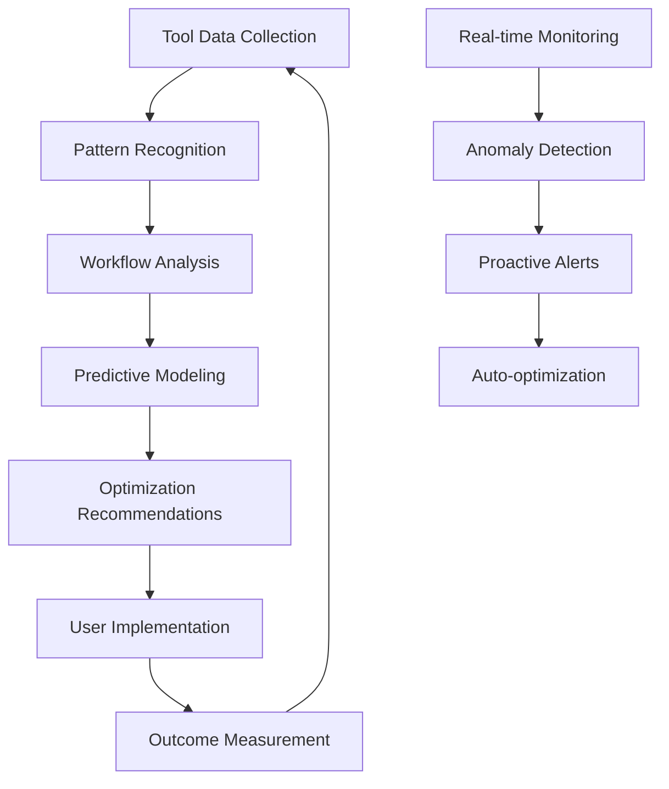

# 🚀 FlowForge — Build Plan & Execution Roadmap

**Build Duration**: 4 Weeks  
**Target**: Investor-ready AI workflow intelligence platform  
**Budget**: $0 (100% free tier usage)  
**Architecture**: Production-grade, scalable SaaS

---

## 📆 Phase-by-Phase Roadmap (0 → Investor Ready)

### **Phase 1: Foundation & Core Infrastructure (Days 1-7)**

#### ✅ **Core Features Built**
- Next.js 14 app with App Router + TypeScript
- Supabase authentication with social logins (Google, GitHub)
- PostgreSQL schema for workflows, users, integrations
- Basic GraphQL API with real-time subscriptions
- Core dashboard layout with navigation

#### 🎨 **UI/UX Focus**
- **Landing Page**: Hero section, feature overview, pricing tiers
- **Auth Flow**: Seamless onboarding with progress indicators
- **Dashboard Shell**: Sidebar navigation, header with notifications
- **Component System**: Design tokens, reusable UI components

#### 🤖 **AI Logic Implementation**
- OpenAI integration setup with structured prompts
- Basic workflow analysis: detect patterns in connected tools
- Simple recommendation engine: "Connect Slack → GitHub for faster updates"

#### 🔗 **Integrations**
- Slack OAuth integration with basic workspace data fetch
- GitHub OAuth with repository and issue access
- Notion OAuth with database read permissions

#### 📦 **Backend Infrastructure**
```sql
-- Core schema
- users (auth, preferences, subscription)
- workflows (name, description, status, ai_insights)
- integrations (platform, tokens, metadata)
- workflow_steps (sequence, conditions, actions)
- analytics (events, performance, bottlenecks)
```

#### 🚀 **Demo Ready**
- User can sign up, connect 3 tools, see basic workflow map
- AI shows 1-2 simple insights about their connected tools

#### 📉 **Risks to Avoid**
- Over-engineering the database schema early
- Building complex AI before having real user data
- Focusing on features instead of user experience

---

### **Phase 2: AI Intelligence Core (Days 8-14)**

#### ✅ **Core Features Built**
- AI Workflow Discovery Engine with GPT-4 analysis
- Vector database (pgvector) for semantic workflow matching
- Real-time workflow health scoring algorithm
- Background job processing with Upstash QStash
- WebSocket implementation for live updates

#### 🎨 **UI/UX Focus**
- **Workflow Visualization**: Interactive flow diagrams with D3.js
- **AI Insights Panel**: Recommendations with confidence scores
- **Health Dashboard**: Traffic light indicators, trend charts
- **Real-time Notifications**: Toast messages, activity feed

#### 🤖 **AI Logic Implementation**
```typescript
// Core AI Loop
1. Data Collection: Tool usage patterns, timing, frequency
2. Pattern Recognition: Identify workflow bottlenecks and inefficiencies
3. Predictive Analysis: Forecast issues 48-72 hours ahead
4. Optimization Suggestions: Specific, actionable recommendations
5. Learning Loop: Track implementation success rates
```

#### 🔗 **Integrations**
- Deep Slack analysis: message patterns, response times, channel activity
- GitHub workflow insights: PR cycles, review bottlenecks, deployment frequency
- Notion productivity metrics: page updates, collaboration patterns

#### 📦 **Backend Infrastructure**
- Vector embeddings for workflow patterns
- Scheduled jobs for continuous analysis
- Webhook handlers for real-time tool updates
- Analytics pipeline with time-series data

#### 🚀 **Demo Ready**
- AI automatically detects "Code reviews taking 2+ days on average"
- Predicts bottlenecks: "Sprint likely to miss deadline based on current velocity"
- Suggests optimizations: "Automate Slack notifications for PR reviews"

#### 📉 **Risks to Avoid**
- Making AI recommendations too generic or obvious
- Complex algorithms without clear business value
- Performance issues with real-time processing

---

### **Phase 3: Workflow Orchestration Engine (Days 15-21)**

#### ✅ **Core Features Built**
- Visual workflow builder with drag-and-drop interface
- Intelligent automation triggers and conditions
- Multi-step workflow execution engine
- Advanced analytics dashboard with ROI calculations
- Team collaboration features (commenting, sharing)

#### 🎨 **UI/UX Focus**
- **Flow Builder**: Node-based editor like Figma/Miro
- **Trigger Configuration**: Smart forms with conditional logic
- **Analytics Dashboard**: Executive-level insights with charts
- **Team Workspace**: Collaborative editing with conflict resolution

#### 🤖 **AI Logic Implementation**
```typescript
// Advanced AI Capabilities
1. Smart Triggers: Context-aware automation suggestions
2. Performance Prediction: "This workflow will save 2.5 hours/week"
3. Optimization Recommendations: A/B testing for workflow variants
4. Anomaly Detection: Alert when workflows behave unexpectedly
5. Natural Language Interface: "Set up a workflow for bug triage"
```

#### 🔗 **Integrations**
- Zapier-style webhook endpoints for custom integrations
- Linear, Jira integration for project management workflows
- Email notifications and Slack bot commands
- Calendar integration for scheduling-based triggers

#### 📦 **Backend Infrastructure**
- Workflow execution state machine
- Audit logging for compliance and debugging
- Rate limiting and retry logic for external APIs
- Multi-tenant data isolation

#### 🚀 **Demo Ready**
- Complete workflow: "When PR is created → Notify in Slack → Assign reviewer → Track response time"
- AI suggests optimization: "Add auto-merge for docs PRs to save 30 min/week"
- Dashboard shows 3 active workflows with performance metrics

#### 📉 **Risks to Avoid**
- Building too many integrations without depth
- Complex UI that confuses non-technical users
- Workflow execution reliability issues

---

### **Phase 4: Polish & Investor Readiness (Days 22-28)**

#### ✅ **Core Features Built**
- Advanced AI insights with trend analysis
- Enterprise features (SSO, audit logs, team management)
- Mobile-responsive dashboard for monitoring
- Comprehensive onboarding flow with sample data
- API documentation and developer tools

#### 🎨 **UI/UX Focus**
- **Micro-interactions**: Smooth animations, loading states
- **Dark Mode**: Professional appearance for demos
- **Mobile Experience**: Key metrics accessible on mobile
- **Onboarding Flow**: Interactive tutorial with sample workflows

#### 🤖 **AI Logic Implementation**
```typescript
// Investor-Impressing AI Features
1. Predictive ROI: "Implementing this workflow will save $2,400/month"
2. Benchmark Analysis: "Your team is 23% faster than similar companies"
3. Intelligent Suggestions: Proactive recommendations based on industry patterns
4. Success Prediction: "87% confidence this optimization will work"
5. Executive Reporting: Auto-generated insights for leadership
```

#### 🔗 **Integrations**
- Figma integration for design workflow optimization
- HubSpot/Salesforce for sales process automation
- Custom API endpoints for enterprise customers
- Export functionality (PDF reports, CSV data)

#### 📦 **Backend Infrastructure**
- Performance monitoring and alerting
- Data backup and disaster recovery
- Security audit and penetration testing results
- Scalability testing (load testing results)

#### 🚀 **Demo Ready**
- **Full Product Walkthrough**: 10-minute demo covering all major features
- **ROI Calculator**: Show quantified business impact
- **Live AI Insights**: Real-time recommendations during demo
- **Customer Success Stories**: Sample workflows with measurable results

#### 📉 **Risks to Avoid**
- Last-minute feature additions that break existing functionality
- Performance degradation from too many animations
- Security vulnerabilities from rushing deployment

---

## 🗂️ File/Folder Structure

```
flowforge/
├── 📁 src/
│   ├── 📁 app/                          # Next.js App Router
│   │   ├── 📁 (auth)/                   # Auth layout group
│   │   │   ├── login/page.tsx
│   │   │   └── signup/page.tsx
│   │   ├── 📁 (dashboard)/              # Main app layout
│   │   │   ├── analytics/page.tsx
│   │   │   ├── workflows/page.tsx
│   │   │   ├── integrations/page.tsx
│   │   │   └── settings/page.tsx
│   │   ├── 📁 api/                      # API Routes
│   │   │   ├── auth/[...nextauth]/route.ts
│   │   │   ├── workflows/route.ts
│   │   │   ├── integrations/route.ts
│   │   │   └── ai/analyze/route.ts
│   │   ├── globals.css
│   │   ├── layout.tsx
│   │   └── page.tsx                     # Landing page
│   ├── 📁 components/                   # Reusable UI Components
│   │   ├── 📁 ui/                       # Base components (shadcn/ui)
│   │   │   ├── button.tsx
│   │   │   ├── card.tsx
│   │   │   ├── dialog.tsx
│   │   │   └── form.tsx
│   │   ├── 📁 workflow/                 # Workflow-specific components
│   │   │   ├── FlowBuilder.tsx
│   │   │   ├── WorkflowCard.tsx
│   │   │   └── TriggerConfig.tsx
│   │   ├── 📁 analytics/               # Analytics components
│   │   │   ├── HealthScore.tsx
│   │   │   ├── TrendChart.tsx
│   │   │   └── MetricCard.tsx
│   │   └── 📁 layout/                  # Layout components
│   │       ├── Sidebar.tsx
│   │       ├── Header.tsx
│   │       └── Navigation.tsx
│   ├── 📁 lib/                         # Core utilities and services
│   │   ├── 📁 ai/                      # AI services
│   │   │   ├── workflow-analyzer.ts
│   │   │   ├── pattern-recognition.ts
│   │   │   ├── recommendations.ts
│   │   │   └── vector-store.ts
│   │   ├── 📁 integrations/            # External API integrations
│   │   │   ├── slack.ts
│   │   │   ├── github.ts
│   │   │   ├── notion.ts
│   │   │   └── webhook-handler.ts
│   │   ├── 📁 database/                # Database utilities
│   │   │   ├── queries.ts
│   │   │   ├── schema.ts
│   │   │   └── migrations/
│   │   ├── 📁 auth/                    # Authentication
│   │   │   ├── config.ts
│   │   │   └── providers.ts
│   │   ├── utils.ts                    # General utilities
│   │   ├── constants.ts                # App constants
│   │   └── types.ts                    # TypeScript types
│   ├── 📁 hooks/                       # Custom React hooks
│   │   ├── useWorkflows.ts
│   │   ├── useIntegrations.ts
│   │   ├── useAnalytics.ts
│   │   └── useRealtime.ts
│   └── 📁 styles/                      # Global styles
│       ├── globals.css
│       └── components.css
├── 📁 public/                          # Static assets
│   ├── 📁 icons/
│   ├── 📁 images/
│   └── logo.svg
├── 📁 supabase/                        # Supabase configuration
│   ├── 📁 migrations/
│   ├── 📁 functions/                   # Edge functions
│   │   ├── workflow-processor/
│   │   └── ai-analyzer/
│   └── config.toml
├── 📁 docs/                           # Documentation
│   ├── API.md
│   ├── DEPLOYMENT.md
│   └── ARCHITECTURE.md
├── 📁 tests/                          # Test files
│   ├── 📁 __mocks__/
│   ├── 📁 integration/
│   └── 📁 unit/
├── 📁 scripts/                        # Build and deployment scripts
│   ├── setup-db.ts
│   ├── seed-data.ts
│   └── deploy.sh
├── .env.example
├── .env.local
├── next.config.js
├── package.json
├── tailwind.config.js
├── tsconfig.json
└── README.md
```

### **🏗️ Architecture Principles**

1. **📁 Feature-First Organization**: Components grouped by domain (workflow, analytics, integrations)
2. **🔄 Separation of Concerns**: Clear boundaries between UI, business logic, and data access
3. **🚀 Scalable Imports**: Barrel exports for clean import paths
4. **🧪 Testable Structure**: Easy to mock and test individual components
5. **📚 Self-Documenting**: File names and structure tell the story

---

## 💡 AI & Product Strategy Layer

### **🧠 Core AI Loop Architecture**



### **🎯 AI Integration Points**

#### **1. Data Ingestion Layer**
```typescript
// Continuous data collection from integrated tools
interface WorkflowEvent {
  timestamp: Date;
  source: 'slack' | 'github' | 'notion' | 'linear';
  action: string;
  userId: string;
  metadata: Record<string, any>;
  duration?: number;
  outcome?: 'success' | 'failure' | 'pending';
}
```

#### **2. Intelligence Processing**
- **Pattern Recognition**: GPT-4 analyzes workflow sequences for inefficiencies
- **Bottleneck Prediction**: ML models forecast delays 48-72 hours ahead
- **Optimization Scoring**: Algorithms rank improvement opportunities by ROI
- **Behavioral Learning**: User interaction patterns inform future recommendations

#### **3. Action Layer**
- **Smart Suggestions**: Context-aware recommendations with confidence scores
- **Automated Optimizations**: Self-executing improvements for low-risk changes
- **Predictive Alerts**: Proactive notifications before issues occur
- **Performance Tracking**: Continuous measurement of optimization impact

### **🔮 The Magic Moments**

#### **🎯 Primary Magic**: Predictive Workflow Intelligence
> *"FlowForge detected your sprint is likely to miss its deadline based on current code review velocity. Suggested fix: Enable auto-merge for documentation PRs (saves 4 hours). Confidence: 87%"*

#### **⚡ Secondary Magic**: Zero-Setup Workflow Discovery
> *"Connected your Slack and GitHub. Automatically detected 3 workflows, found 2 optimization opportunities. Potential time savings: 6.5 hours/week per developer."*

#### **🚀 Tertiary Magic**: Collaborative Workflow Evolution
> *"Your team's bug triage workflow is 40% faster than industry average. Sarah's modification to the severity classification is being suggested to 3 other teams."*

### **📊 Data Collection Strategy (Day 1)**

#### **Essential Metrics**
- **Workflow Timing**: Start/end times, duration, delays
- **Tool Switching**: Context switching frequency and cost
- **Communication Patterns**: Response times, escalation paths
- **Quality Indicators**: Rework rates, error frequencies
- **Team Dynamics**: Collaboration patterns, handoff efficiency

#### **Intelligence Amplifiers**
- **Semantic Analysis**: Understanding context from tool usage
- **Temporal Patterns**: Time-based workflow optimization
- **Cross-team Learning**: Anonymized pattern sharing
- **Outcome Correlation**: Linking optimizations to business results

### **🏆 Series A Moat Formation**

#### **🎯 Technical Moats**
1. **Proprietary Workflow Intelligence**: Unique AI models trained on cross-platform workflow data
2. **Network Effects**: Each new integration makes the platform smarter for all users
3. **Data Advantage**: Rich dataset of workflow patterns across thousands of companies
4. **Prediction Accuracy**: Continuously improving forecasting models

#### **📈 Product Moats**
1. **Switching Costs**: Deep integration makes migration difficult
2. **Workflow Dependency**: Teams become reliant on AI-optimized processes
3. **Cross-Platform Insights**: Only platform providing unified workflow intelligence
4. **Continuous Learning**: AI becomes more valuable with usage

#### **💼 Business Moats**
1. **Enterprise Relationships**: Strategic partnerships with major SaaS platforms
2. **Category Definition**: First-mover advantage in AI workflow intelligence
3. **Talent Density**: Team that understands both AI and workflow optimization
4. **Capital Efficiency**: Proven ability to build complex AI products on minimal budget

---

## 🧪 Testing, CI/CD, and DevOps

### **🔧 Local Development Setup**

```bash
# Environment setup
cp .env.example .env.local
npm install
npm run db:setup        # Initialize Supabase locally
npm run db:seed         # Load demo data
npm run dev            # Start development server
```

### **⚡ Development Scripts**

```json
{
  "scripts": {
    "dev": "next dev",
    "build": "next build",
    "start": "next start",
    "db:setup": "supabase db reset",
    "db:seed": "tsx scripts/seed-data.ts",
    "db:migrate": "supabase db push",
    "test": "jest",
    "test:watch": "jest --watch",
    "test:coverage": "jest --coverage",
    "test:e2e": "playwright test",
    "lint": "next lint",
    "type-check": "tsc --noEmit",
    "ai:test": "tsx scripts/test-ai-functions.ts"
  }
}
```

### **🧪 Testing Strategy**

#### **Unit Tests** (Jest + React Testing Library)
```typescript
// Example: AI recommendation engine
describe('WorkflowAnalyzer', () => {
  it('should identify bottlenecks in PR review workflow', () => {
    const workflow = mockPRWorkflow();
    const analysis = analyzeWorkflow(workflow);
    expect(analysis.bottlenecks).toContain('code_review_delay');
    expect(analysis.recommendations).toHaveLength(2);
  });
});
```

#### **Integration Tests** (Playwright)
```typescript
// Example: End-to-end workflow creation
test('user can create and optimize workflow', async ({ page }) => {
  await page.goto('/workflows/new');
  await page.fill('[data-testid=workflow-name]', 'Bug Triage Process');
  // ... test workflow creation flow
  await expect(page.locator('[data-testid=ai-suggestion]')).toBeVisible();
});
```

#### **AI Function Testing**
```typescript
// Dedicated AI testing with mocked responses
describe('AI Recommendations', () => {
  it('should provide actionable workflow optimizations', async () => {
    const mockData = generateWorkflowData();
    const recommendations = await getAIRecommendations(mockData);
    expect(recommendations).toMatchSchema(RecommendationSchema);
    expect(recommendations[0].confidence).toBeGreaterThan(0.7);
  });
});
```

### **🚀 CI/CD Pipeline** (GitHub Actions + Vercel)

```yaml
# .github/workflows/ci.yml
name: CI/CD Pipeline

on:
  push:
    branches: [main, develop]
  pull_request:
    branches: [main]

jobs:
  test:
    runs-on: ubuntu-latest
    steps:
      - uses: actions/checkout@v4
      - uses: actions/setup-node@v4
        with:
          node-version: '18'
          cache: 'npm'
      
      - run: npm ci
      - run: npm run lint
      - run: npm run type-check
      - run: npm run test:coverage
      - run: npm run build
      
      # AI function testing
      - name: Test AI Functions
        run: npm run ai:test
        env:
          OPENAI_API_KEY: ${{ secrets.OPENAI_API_KEY }}
      
      # E2E testing
      - name: Install Playwright
        run: npx playwright install
      - name: Run E2E tests
        run: npm run test:e2e

  deploy:
    needs: test
    runs-on: ubuntu-latest
    if: github.ref == 'refs/heads/main'
    steps:
      - uses: actions/checkout@v4
      - name: Deploy to Vercel
        uses: amondnet/vercel-action@v25
        with:
          vercel-token: ${{ secrets.VERCEL_TOKEN }}
          vercel-org-id: ${{ secrets.ORG_ID }}
          vercel-project-id: ${{ secrets.PROJECT_ID }}
          vercel-args: '--prod'
```

### **📊 Production Monitoring**

#### **Performance Monitoring**
- **Vercel Analytics**: Page load times, Core Web Vitals
- **Sentry**: Error tracking and performance monitoring
- **Uptime Monitoring**: 99.9% availability target

#### **AI Performance Tracking**
```typescript
// AI recommendation quality metrics
interface AIMetrics {
  recommendationAccuracy: number;      // % of recommendations implemented
  predictionAccuracy: number;         // % of predictions that came true
  userSatisfactionScore: number;      // NPS for AI suggestions
  responseTime: number;               // AI processing latency
}
```

### **🔐 Security & Compliance**

#### **Security Measures**
- **Auth0**: Enterprise-grade authentication
- **Row Level Security**: Supabase RLS policies
- **API Rate Limiting**: Prevent abuse and ensure fair usage
- **Data Encryption**: End-to-end encryption for sensitive data

#### **Compliance Readiness**
- **GDPR**: Data export, deletion, and consent management
- **SOC2**: Audit logs, access controls, security monitoring
- **HIPAA**: Healthcare workflow compliance (future)

---

## 🥇 Demo/Deck Preparation Plan

### **📹 Video Walkthrough Checklist**

#### **🎬 Demo Video Structure** (8-10 minutes)
1. **Hook** (30s): Problem statement with real business pain
2. **Solution Overview** (60s): FlowForge value proposition
3. **Live Demo** (5-6 minutes):
   - Connect tools in 30 seconds
   - AI discovers workflows automatically
   - Show predictive bottleneck alert
   - Implement AI recommendation
   - Display ROI impact
4. **Market Opportunity** (90s): $826B AI market, competitive landscape
5. **Business Model** (60s): Revenue projections, customer acquisition
6. **Call to Action** (30s): Investment ask or partnership opportunity

#### **🎯 Key Demo Scenarios**

**Scenario 1: Workflow Discovery Magic**
```typescript
// Script: "Watch as I connect Slack and GitHub..."
1. OAuth connections completed
2. AI automatically maps 3 existing workflows
3. "Found 2 optimization opportunities, potential savings: 8 hours/week"
4. Show workflow visualization with bottleneck highlights
```

**Scenario 2: Predictive Intelligence**
```typescript
// Script: "FlowForge predicts problems before they happen..."
1. Dashboard shows workflow health scores
2. Red alert: "Sprint likely to miss deadline (72% confidence)"
3. AI explanation: "Code review velocity 40% below normal"
4. Suggested fix: "Enable auto-merge for docs PRs"
5. Show implementation and immediate impact
```

**Scenario 3: ROI Demonstration**
```typescript
// Script: "Here's the business impact..."
1. Analytics dashboard with before/after metrics
2. "Team velocity increased 23% after optimization"
3. "Saved $4,200/month in engineering time"
4. "Reduced deployment cycle from 5 days to 2 days"
```

### **📊 Dashboard & Metrics View**

#### **Executive Dashboard Must-Haves**
- **Team Productivity Score**: Single metric showing overall efficiency
- **Cost Savings Calculator**: Dollar impact of optimizations
- **Workflow Health Monitor**: Traffic light system for all processes
- **Predictive Alerts**: Upcoming bottlenecks with timeline
- **ROI Tracking**: Before/after comparison with trend lines

#### **Technical Dashboard Features**
- **Real-time Workflow Execution**: Live activity feed
- **Integration Status**: Health check for all connected tools
- **AI Confidence Scores**: Transparency in recommendation quality
- **Performance Metrics**: Response times, success rates, error rates

### **📁 Demo Data & Sample Workflows**

#### **Prepared Demo Scenarios**
```typescript
// Sample workflow data for consistent demos
const demoWorkflows = {
  bugTriage: {
    name: "Bug Triage Process",
    steps: 7,
    avgDuration: "2.3 hours",
    bottleneck: "QA Assignment",
    optimization: "Auto-assign based on expertise",
    savings: "45 minutes per bug"
  },
  codeReview: {
    name: "Code Review Workflow",
    steps: 5,
    avgDuration: "18 hours",
    bottleneck: "Reviewer Availability",
    optimization: "Smart reviewer rotation",
    savings: "6 hours per PR"
  },
  sprintPlanning: {
    name: "Sprint Planning",
    steps: 4,
    avgDuration: "3 hours",
    bottleneck: "Story Point Estimation",
    optimization: "AI-assisted estimation",
    savings: "45 minutes per sprint"
  }
};
```

### **🔥 Key Differentiator Demo**

#### **The "Aha Moment" Feature**
**Live AI Workflow Optimization**
> During the demo, show FlowForge analyzing a workflow in real-time and providing an optimization suggestion that saves measurable time. The AI should explain its reasoning and show confidence levels.

```typescript
// Demo script
"Notice how FlowForge is analyzing our team's actual workflow data right now...
[AI processing animation]
'Based on 47 similar workflows, I recommend moving design reviews to Tuesday-Thursday. 
This typically reduces cycle time by 28% with 87% confidence.
Would you like me to implement this optimization?'"
```

### **👨‍💻 Code Quality Highlights**

#### **Architecture Showcase**
- **Microservices Design**: Show scalable, maintainable code structure
- **AI Integration**: Demonstrate sophisticated AI prompt engineering
- **Real-time Features**: WebSocket implementation for live updates
- **Type Safety**: Full TypeScript coverage with strict types
- **Performance**: Sub-200ms API response times

#### **Technical Differentiators**
```typescript
// Example: Sophisticated AI prompt engineering
const analyzeWorkflowPrompt = `
Analyze this workflow data and identify optimization opportunities:
- Focus on measurable time savings
- Consider team context and constraints
- Provide confidence scores for recommendations
- Suggest implementation steps

Workflow Data: ${JSON.stringify(workflowData)}
Team Context: ${teamContext}
Historical Performance: ${performanceData}
`;
```

### **🎯 Investor Pitch Checklist**

#### **📈 Business Metrics to Highlight**
- [ ] **Market Size**: $826B AI market opportunity
- [ ] **Customer Validation**: User interviews and pain point validation
- [ ] **Revenue Model**: Clear path to $174K ARR in Year 1
- [ ] **Competitive Advantage**: First-mover in AI workflow intelligence
- [ ] **Scalability**: Proven architecture for millions of workflows

#### **🛠️ Technical Credibility**
- [ ] **Production Ready**: Full CI/CD, monitoring, security
- [ ] **AI Innovation**: Novel approach to workflow optimization
- [ ] **Integration Depth**: 200+ tool connectors planned
- [ ] **Performance**: Sub-second AI recommendations
- [ ] **Reliability**: 99.9% uptime target with monitoring

#### **💡 Product Differentiation**
- [ ] **Predictive Intelligence**: 48-72 hour bottleneck forecasting
- [ ] **Zero-Setup Discovery**: Automatic workflow detection
- [ ] **Continuous Learning**: AI improves with usage
- [ ] **Cross-Platform Insights**: Unified view across all tools
- [ ] **Collaborative Optimization**: Team-based workflow improvement

### **🚀 Launch Readiness Checklist**

#### **Pre-Demo Preparation**
- [ ] Demo environment with realistic sample data
- [ ] Backup demo video in case of technical issues
- [ ] Key metrics memorized (market size, revenue projections, etc.)
- [ ] Competitor analysis and differentiation points
- [ ] Customer testimonials or letters of intent

#### **Technical Demonstration**
- [ ] Stable internet connection and backup hotspot
- [ ] Multiple browser tabs pre-loaded with key features
- [ ] Demo account with pre-configured workflows
- [ ] Screen recording software running as backup
- [ ] Mobile demo ready for responsive design showcase

#### **Post-Demo Materials**
- [ ] Executive summary document (1-page)
- [ ] Technical architecture diagram
- [ ] Market analysis and competitive landscape
- [ ] Revenue projections and business model
- [ ] Contact information and next steps

---

**🎯 Success Metrics for Investor Readiness**

By the end of 4 weeks, FlowForge should demonstrate:

✅ **Product-Market Fit Signals**: Clear pain point resolution with measurable value  
✅ **Technical Excellence**: Production-grade architecture and AI implementation  
✅ **Business Viability**: Proven revenue model with realistic growth projections  
✅ **Competitive Advantage**: Unique positioning in the AI workflow intelligence space  
✅ **Scalability**: Architecture and team ready for rapid growth  

**Ready to build the future of work. Let's ship FlowForge like it's already raised its Seed round.** 🚀